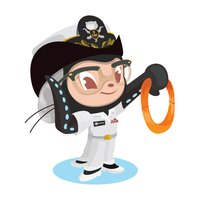
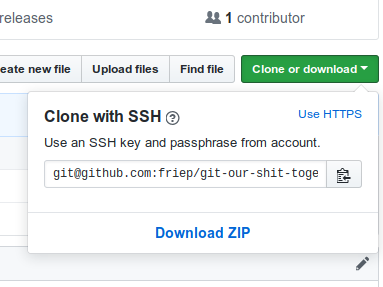
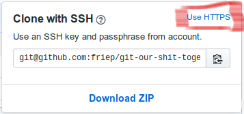
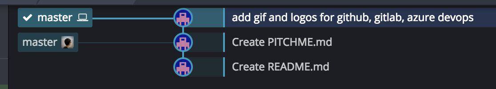
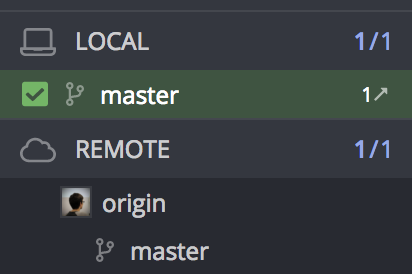
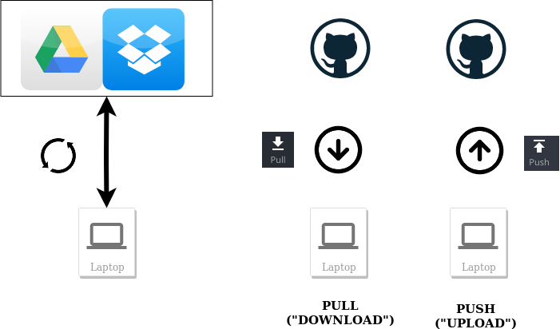
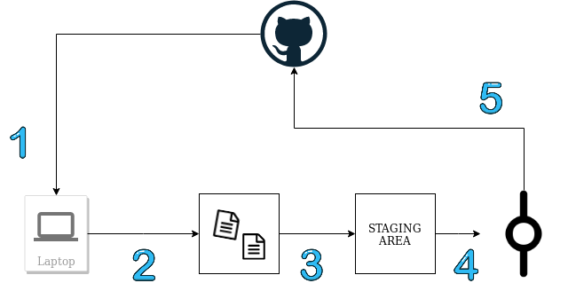
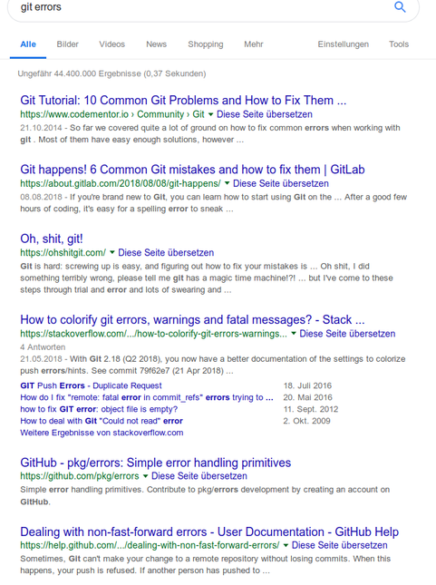

# Git Workshop - Let's git our shit together!

--- 

### Who am I? 
- Frie(~drike~) Preu
- data scientist / IT consultant / software developer bei codecentric 
- bei CorrelAid: IT Infrastruktur, interne Projekte (R Packages, ...) 
- Add me:
    - LinkedIn: [Friedrike Preu](https://www.linkedin.com/in/friedrike-preu-a2bb46a7/)
    - Twitter: [@ameisen_strasse](https://twitter.com/ameisen_strasse)
    - GitHub: [friep](https://github.com/friep)

---

### Installation und Accounterstellung
- siehe `README` des Repositories
- [www.github.com/friep/git-our-shit-together](www.github.com/friep/git-our-shit-together)

---

### Partner up!

- Mona Lovalace Octocat

- Grace Hopper Octocat

---

### Warum Git?

- Masterarbeit.docx
- Masterarbeit_v1.docx
- Masterarbeit_FINAL.docx
- Masterarbeit_FINAL_TimsKommentare.docx
- Masterarbeit_FINAL_FINAL.docx

---

---

### Version Control to the Rescue!
- Beispiel: diese Präsentation. 

---

# Daten runterladen - Fork und Clone

---

### Fork und Clone

@box[bg-blue text-black rounded](Repository#"A Git repository is a virtual storage of your project. It allows you to save versions of your code, which you can access when needed." ([Source](https://www.atlassian.com/git/tutorials/setting-up-a-repository)))

@box[bg-blue text-black rounded](Fork#"A fork is a copy of a repository. Forking a repository allows you to freely experiment with changes without affecting the original project." ([Source](https://help.github.com/articles/fork-a-repo/)))

---

### Hands On 1 - Fork und Clone
 
#### Mona

@ol

- [https://github.com/friep/git-our-shit-together/](https://github.com/friep/git-our-shit-together/): Fork (oben rechts)
- `https://github.com/{USERNAME}/git-our-shit-together` öffnet sich
- unter Settings->Collaborators Grace hinzufügen

@olend

---

### Hands On 2 - Fork und Clone

#### Mona & Grace

@ol

- Gitkraken Clone Repo -> Clone with URL
- Kopierten Link unter URL eintragen

@olend

---

# Authentification 

--- 

### Authentification - Passwort

- bei jedem Push GitHub Passwort eingeben
- beachte: clone `https://...` 

--- 

### Authentification - SSH
- public key, private key cryptography (siehe z.B. [Youtube](https://www.youtube.com/watch?v=AQDCe585Lnc))
- nur einmal einrichten -> 
- clone `ssh://...`

---

### Hands On 1.1: Gitkraken mit Github verbinden

@ol

- Gitkraken Profil (rechts oben)
- Preferences->Authentification->GitHub
- connect to GitHub
- Generate SSH key and add to GitHub

@olend

---

# Daten speichern - Add und Commit 

---
### Commit

@box[bg-blue text-black rounded](Commit#"A commit is the Git equivalent of a "save".[...] Git committing is an operation that acts upon a collection of files and directories." ([Source](https://www.atlassian.com/git/tutorials/saving-changes))

--> Commit = Ein "Speicherpunkt" in Git. 

--- 

### Commit history

---

### Go back in time! 

---

### Hands On 2 - Go back in time 

@ol

- `reset master to this commit`
- spiele mit: `hard`, `mixed`, `soft`
- `fast forward master to origin/master` (oberster commit)

@olend

---

### Commit

- Commit hält **Veränderungen** gegenüber dem vorherigen Commit fest
    - Änderungen von Dateien
    - Neuerstellung von Dateien
    - Löschung von Dateien
    - Umbenennung von Dateien
- ein Commit kann mehrere Änderungen beinhalten

---

### Adding und Staging Area 

(Source: [https://git-scm.com/about/staging-area](https://git-scm.com/about/staging-area))

---

### Hands On 3 - einen Commit machen 

Grace + Mona

@ol

-  Change stuff!
- **GIT ADD** von den "Unstaged Files" Dateien **GIT ADD**en, die man in Git "speichern" möchte. 
- (halbwegs) aussagekräftige Commit Message schreiben
- **GIT COMMIT** 

@olend

---

### Git quizzed!

---

### Git quizzed!

--- 

# Daten syncen - Push und Pull

---

### Git  Hosting

- Die Cloud! z.B.

@fa[gitlab]
@fa[github]

---

### Git Lokal und Git Remote 

... what? 

@ul

- **Lokal**: dein PC
- **Remote**: in der Cloud (GitHub, GitLab, ...)

@ulend 

---

### Sync: Git Pull und Git Push

- Git Pull: neue Commits von GitHub downloaden
- Git Push: lokal erstellte Commits nach GitHub hochladen

---

### Sync: Git Pull und Git Push

---

--- 

### Hands On 4 - Pull und Push

@ol

- Grace: Push 
- Mona: Pull 
- Mona: Push 
- Grace: Pull

@olend

--- 

### Git quizzed!

--- 

### Git quizzed!

---

# When things go wrong...

---

---

---

### When things go wrong...

@ol

- so lange nichts gepusht ist, alles (halbwegs) gut --> oft committen!
- zur Not: Codestand sichern und neu clonen 

@olend 

--- 

### Merge conflicts

@box[bg-blue text-black rounded](Merge conflicts#"Merge conflicts occur when competing changes are made to the same line of a file, or when one person edits a file and another person deletes the same file." ([Source](https://help.github.com/en/articles/resolving-a-merge-conflict-using-the-command-line)))

### Merge conflicts
- müssen lokal und **manuell** gelöst werden --> entscheiden, welche Version man beibehält
- integriertes [Merge Conflict Tool in Gitkraken](https://blog.axosoft.com/merge-conflict-tool/)

### Hands on 5: Merge conflicts

@ol
- Mona oder Grace: editiert **auf GitHub** das Readme in einer Zeile
- Mona & Grace: editiert bei sich lokal das Readme in der gleichen Zeile (etwas anderes)
- Mona & Grace: eigene Änderung committen (nicht pushen!)
- Mona & Grace: `pull` 
- Mona & Grace: merge conflict lokal lösen und die eigene Version pushen.

@olend 

---

### Sidenote: Git stash

@box[bg-blue text-black rounded](Stash#"git stash temporarily shelves (or stashes) changes you've made to your working copy so you can work on something else, and then come back and re-apply them later on. Stashing is handy if you need to quickly switch context and work on something else, but you're mid-way through a code change and aren't quite ready to commit". ([Source](https://www.atlassian.com/git/tutorials/saving-changes/git-stash)))

---

### Git stash

--> put it away for now!

---

### Git stash bei merge conflicts

@ol

- git stash
- git pull
- apply stash 
- solve merge conflicts 
- (delete stash)

@olend

---

# mit GitHub arbeiten

---

### Issues

@ul

- issues: Todos / Bugs / Ideen
- jeder issue hat eine Nummer
- #issueno in commit message verknüpft commit mit issue

@ulend

- Beispiel: [https://github.com/jandix/sealr/issues](https://github.com/jandix/sealr/issues) 

---

### Hands On 6: Issue

@ol

- Mona: Issue erstellen: "Add Grace's favorite GIF"
- Grace: füge der Präsentation eine neue Folie hinzu mit deinem Lieblingsgif (giphy -> copy link)
- Grace: add + commit. verlinke issue Nummer in der commit message (#issueno)
- Grace: push
- Mona: Issue neu laden (STRG+R)

@olend

---

### Fazit Issues

@ul

- sehr nützlich zur Projektorganisation
- Diskussion ist zentralisiert (aber: keine sensiblen Informationen in GitHub!)
- Tipp: Projekt mit Kanban Board (siehe "Projects" in GitHub) zum Prozesstracking (todo, in progress, done)

@ulend

--> bitte verwenden!

---

# Branches und Pull Requests

---

---

---

### Branches

@box[bg-blue text-black rounded](Branch#A branch represents an independent line of development. Branches serve as an abstraction for the edit/stage/commit process. You can think of them as a way to request a brand new working directory, staging area, and project history. [Source](https://www.atlassian.com/git/tutorials/using-branches))

---

### Branches

@box[bg-blue text-black rounded](Checkout#The git checkout command lets you navigate between the branches created by git branch. Checking out a branch updates the files in the working directory to match the version stored in that branch, and it tells Git to record all new commits on that branch. Think of it as a way to select which line of development you’re working on. [Source](https://www.atlassian.com/git/tutorials/using-branches/git-checkout))

---

### Why branches?

@ul

- Stabilität: Nur working code auf "master" branch --> z.B. Download von GitHub (`devtools::install_github()`) oder continuous deployment
- Kollaboration: unabhängige Entwicklung von Code ("feature branches")
- Experimente: Branch einfach wieder löschen. 

@ulend

- Beispiel: [https://github.com/jandix/sealr/branches](https://github.com/jandix/sealr/branches)

---

### Branches Workflow

@ol

- Branch in Gitkraken erstellen mit aussagekräftigem Namen (z.B. issue1-add-favorite-gif)  
- branch auschecken (Doppelklick on Icon in Gitkraken)
- normal weiterarbeiten (pull-commit-push cycles)
- (optional: merge andere branches in deinen branch um Updates zu bekommen)
- merge Branch in master branch 

@olend

---

### Merging branches

- Rechtsclick auf branch name / master
- hängt davon ab, wer "weiter vorne" ist (?)
    - wenn neue commits auf master: merge master into issue1-add-favorite-gif -> branch wird geupdatet
    - wenn neue commits auf branch: merge issue1-add-favorite-gif into master -> master wird geupdatet

### Pull Requests

@box[bg-blue text-black rounded](Pull requests#Pull requests let you tell others about changes you've pushed to a branch in a repository on GitHub. Once a pull request is opened, you can discuss and review the potential changes with collaborators and add follow-up commits before your changes are merged into the base branch.[Source](https://help.github.com/en/articles/about-pull-requests))

### Pull Requests

@ul

- in Kombination mit Branches verwenden
- "Review" Funktionalität
- 

@ulend 

---

### Branches und Pull Requests Fazit

@ul

- besonders nützlich bei Entwicklung von Packages oder Applikationen (z.B. Shiny Dashboards): Feature Branches. 
- Relevanz für Datenprojekte: z.B. paralleles Ausprobieren von verschiedenen Modellansätzen. 
- Pull Requests (PR) zentralisieren Diskussion an einem Ort. 

@ulend

---

# Das wars. 

### Morgen dann Setup eurer GitHub Repos - schon mal Namen überlegen! ;) #priorities